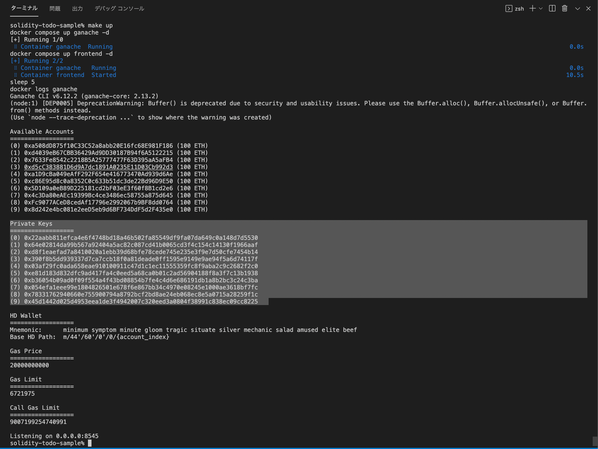
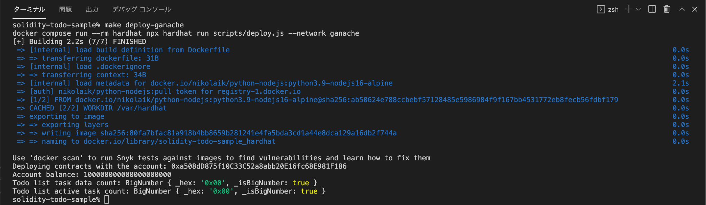
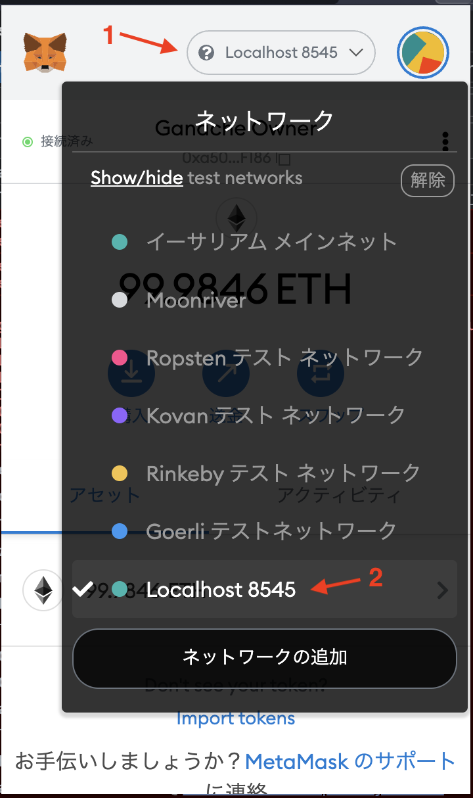
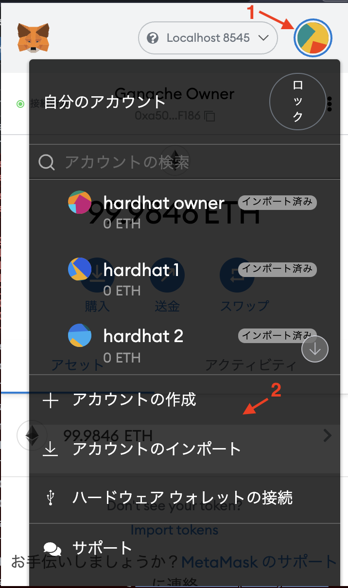
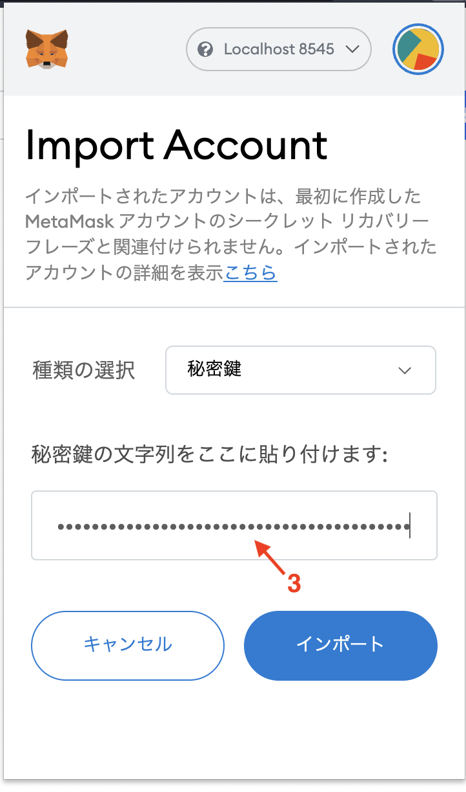
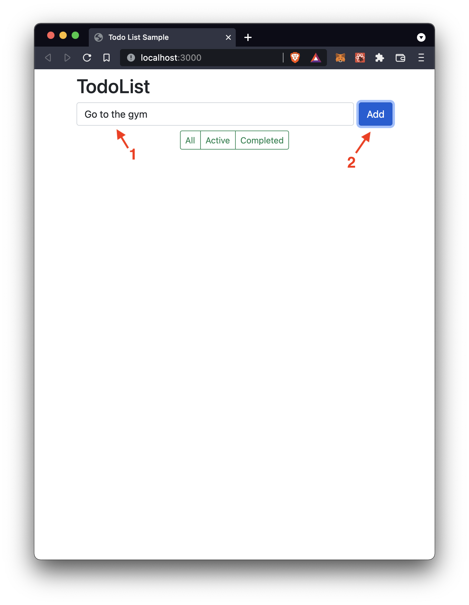
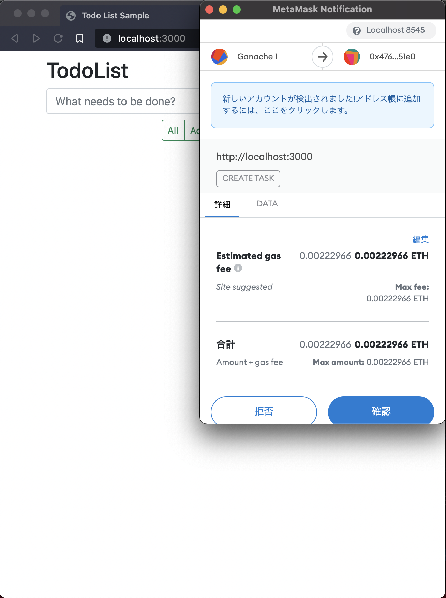
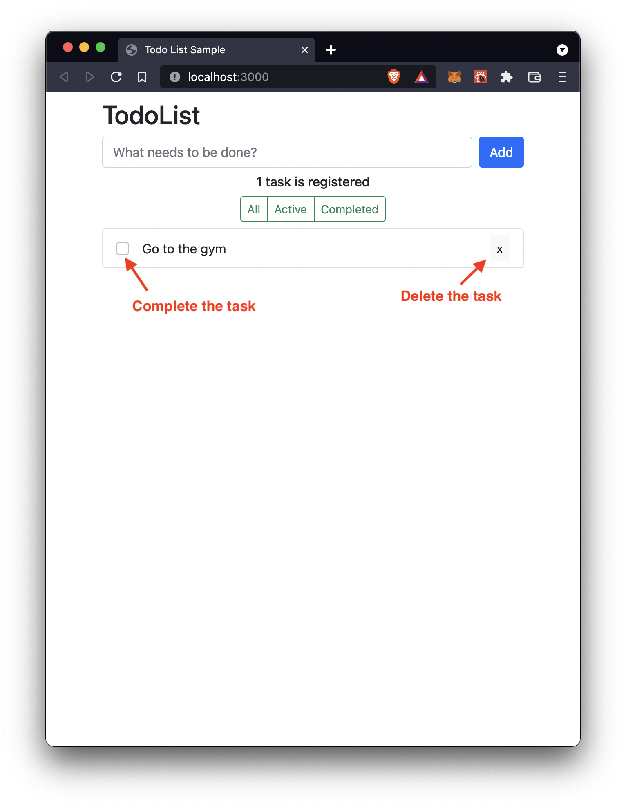
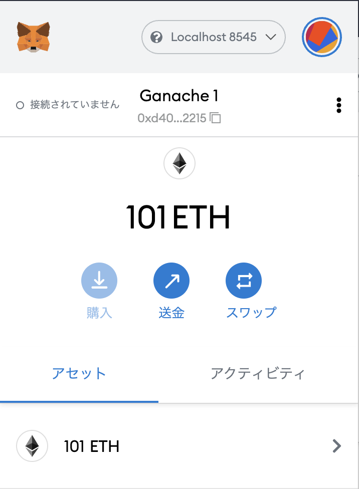
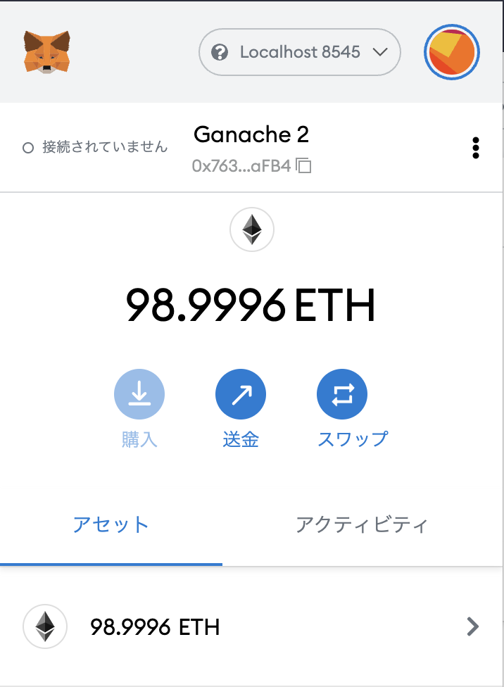

# solidity-todo-sample

## Requirement

```shell
% sw_vers
ProductName:    macOS
ProductVersion: 11.6.1
BuildVersion:   20G224
% docker -v
Docker version 20.10.8, build 3967b7d
```

## Quick start

These are the steps.

1. Setup the components
2. Start the local network
3. Deploy the todo smart contract
4. Set up MetaMask browser extension
5. Open the Todo App
6. Clean up

### 1. Start the local network

#### 1-1. Setup components

```shell
% git clone https://github.com/kennyttotheleft/solidity-todo-sample.git
% cd solidity-todo-sample
% make setup
```

#### 1-2. Start local network

```shell
% make up-network
wait a few seconds...
% make check-network
```

After the last command, 10 test accounts and private keys will be displayed.
If not, wait few more seconds to start the network and re-run `make check-network` again.
Please pickup one private key you like to set up MetaMask on the step 3.



### 2. Deploy the todo smart contract

```shell
% make deploy-ganache
```

After you see the message like below, let's access the todo app.


### 3. Set up [MetaMask](https://metamask.io/) browser extension

#### 3-1. Install the MetaMask browser extension

[Chrome web store -> MetaMask](https://chrome.google.com/webstore/detail/metamask/nkbihfbeogaeaoehlefnkodbefgpgknn?hl=ja).

#### 3-2. Connect to local network (Localhost:8485) from MetaMask



#### 3-3. Import a test account

Open the `import account` window. Then set the test private key that you picked up on the step 1.

| Account menu | Import Account|
|---|---|
|  |  |

### 4. Open the Todo App

Open the URL and then connect the app to MetaMask.

```shell
% make up-frontend
% open http://localhost:3000
```

After you make a task, you can pay the gas fee via MetaMask.

| Make a task | Pay Gas Fee |
|---|---|
| | |

Also you need the gas fee when you complete and delete a task.



### 5. Clean up

If you finished playing the app. You can delte related docker images, volumes, network by running the command.

```shell
% make down
```

---

## Development

### Setup Hardhat project

If you would like to create new project, you can use `make project` command.

```shell
% git clone https://github.com/kennyttotheleft/solidity-todo-sample.git
% cd solidity-todo-sample
% make project
% npm install
```

## Hardhat network

Hardhat network for localhost is available on this sample. You can deploy hardhat network with two terminals.

First, boot the hardhat network in terminal-A.

```shell
% make hardhat-node
```

After the hardhat network was booted, you can deploy to the network in terminal-B.

```shell
% make deploy-hardhat
```

## Ganache

Ganache is also available if you would like to persist account data. You can start the Ganache network with the make command below.
The data will be created on `volume/ganache/data`.

```shell
% make ganache
```

You can view the persisted balance of the accounts with MetaMask like below. These screenshots were taken after the ganache container was rebooted.

| Account 1 | Account 2 |
|---|---|
|||

Also you can deploy contracts to the Ganache network like Hardhat above.

```shell
% make deploy-ganache
```

---

## Reference

- [Solidity Docs](https://solidity-jp.readthedocs.io/ja/latest/index.html)
- [Solidity by Example v 0.8.3](https://solidity-by-example.org/)
  - [ethereum/solidity-examples](https://github.com/ethereum/solidity-examples)
- [How to Build Ethereum Dapp with React.js · Complete Step-By-Step Guide](https://www.dappuniversity.com/articles/ethereum-dapp-react-tutorial)
- [drizzleでブロックチェーンTodoアプリを作る](https://qiita.com/hitsuji-haneta/items/5d4f7717335a2887d197#%E3%83%95%E3%83%AD%E3%83%B3%E3%83%88%E3%82%A8%E3%83%B3%E3%83%89%E5%81%B4%E3%81%AE%E6%A7%8B%E7%AF%89)
- [Hardhat | Ethereum development environment for professionals by Nomic Labs](https://hardhat.org/)
  - [Hardhat Tutorial](https://hardhat.org/tutorial/)
  - [MetaMask chainId issue](https://hardhat.org/metamask-issue.html)
  - [Testing with ethers.js & Waffle](https://hardhat.org/guides/waffle-testing.html)
- [trufflesuite/ganache-cli](https://hub.docker.com/r/trufflesuite/ganache-cli/dockerfile)
  - [https://github.com/digitaldonkey/ganache-cli-docker-compose/blob/master/docker-compose.yml](https://github.com/digitaldonkey/ganache-cli-docker-compose/blob/master/docker-compose.yml)
  - [https://github.com/celo-org/ganache-cli/blob/master/Dockerfile](https://github.com/celo-org/ganache-cli/blob/master/Dockerfile)
- [Chai Assertion Library - BDD](https://www.chaijs.com/api/bdd/)
- [Solidity Best Practices for Smart Contract Security](https://consensys.net/blog/developers/solidity-best-practices-for-smart-contract-security/)
- [Bootstrap v5.0 Docs](https://getbootstrap.jp/docs/5.0/getting-started/introduction/)
- [React-Bootstrap Docs](https://react-bootstrap.netlify.app/getting-started/introduction/)
- [Eventにつけるindexedの役割](https://y-nakajo.hatenablog.com/entry/2017/12/08/144643)
- [reentry-attack.sol](https://github.com/raineorshine/solidity-by-example#reentry-attacksol)
